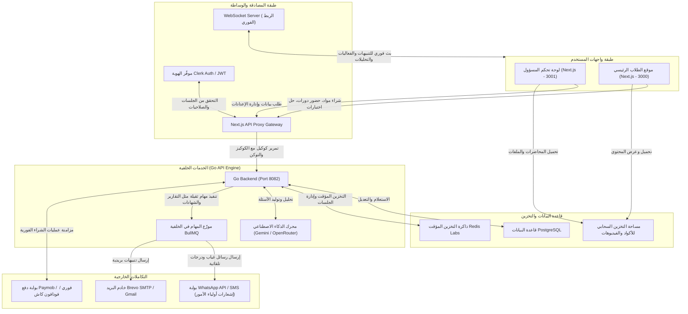
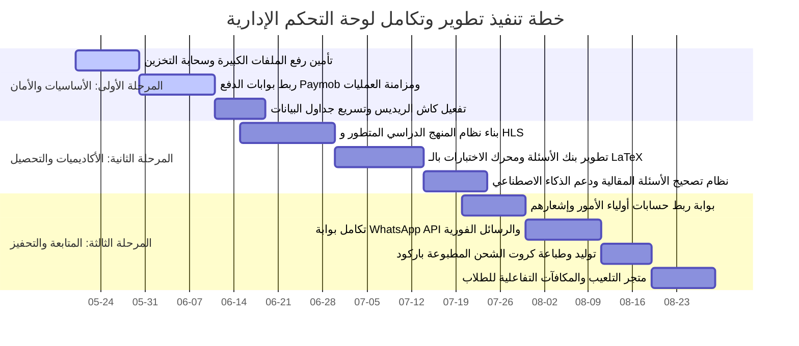

# خريطة الطريق الشاملة لتطوير وتكامل لوحة التحكم الإدارية (Admin Dashboard) لمنصة Thanawy التعليمية

لقد قمنا بإجراء تحليل شامل لبنية الكود الحالي لمنصة **Thanawy** التعليمية المبنية باستخدام **Next.js (TypeScript/TailwindCSS)** والتي تعتمد على جلب البيانات وتمريرها كوكيل (Proxy) إلى خادم خلفي مبني بلغة **Go (Golang)**. 

من خلال دراسة المكونات، والـ API Routes المتاحة، وهيكلة الإعدادات العامة، قمنا بإعداد **خريطة طريق استراتيجية متكاملة** مقسمة إلى أربعة محاور أساسية (**تطويرات، تحسينات، إصلاحات، وتكاملات**) لتجعل لوحة التحكم والمنصة ككل تعمل كجسد واحد متناسق ومستقر بنسبة 100%.

---

## 🗺️ المخطط العام للمنصة ومسار ربط لوحة التحكم بموقع الطلاب

يوضح المخطط التالي كيفية سريان البيانات والتكامل التام بين لوحة التحكم وموقع الطلاب عبر الطبقات المختلفة:

---

## 1. التطويرات والميزات الجديدة المطلوبة (Developments)
للانتقال بلوحة التحكم من مجرد نظام لإدارة المواد والدورات التقليدية إلى نظام إدارة تعليمي متكامل (LMS) فائق التطور:

### أ. نظام المنهج الدراسي المرن والمحمي (Curriculum & DRM System)
*   **مشغل فيديو محمي من السرقة والنسخ (DRM & Anti-Screen Record):**
    *   دمج بروتوكول **HLS (HTTP Live Streaming)** بالكامل مع تشفير الـ AES-128 لحماية محتوى الفيديوهات من التحميل المباشر.
    *   إضافة ميزة **العلامة المائية الديناميكية المتغيرة (Dynamic Watermark)** التي تعرض رقم هاتف الطالب واسمه بشكل متحرك على الفيديو لمنع تصوير الشاشة بالهواتف.
    *   التحكم في سرعة التشغيل، وإمكانية إكمال المشاهدة من حيث توقف الطالب بشكل متزامن بين جميع الأجهزة.
*   **إدارة ملخصات المحاضرات والمرفقات:**
    *   تطوير واجهة سحب وإفلات لترتيب عناصر المحاضرة (فيديو، ملف PDF، اختبار قصير، صوتيات).

### ب. مركز الاختبارات وبنك الأسئلة المتطور (Advanced Exam & Question Bank Builder)
*   **بنك الأسئلة المركزي (Question Bank Classifier):**
    *   تصنيف الأسئلة حسب المادة، الباب، مستوى الصعوبة (سهل، متوسط، صعب)، ونوع السؤال (اختيار من متعدد MCQ، صح وخطأ، سؤال مقالي).
    *   دعم المعادلات الرياضية والفيزيائية والكيميائية المعقدة من خلال تكامل **LaTeX / KaTeX** في محرر النصوص للأسئلة والإجابات.
*   **التصحيح المقالي الإلكتروني واليدوي:**
    *   تطوير لوحة خاصة بالمصححين أو المدرسين المساعدين (Teaching Assistants) لتصحيح الإجابات المقالية للطلاب يدويًا مع رصد الدرجات وكتابة الملاحظات.
    *   إمكانية الاستعانة بـ **Gemini AI** المدمج في النظام لتقديم تقييم أولي مقترح للإجابات المقالية وتوفير الوقت على المعلمين.

### ج. لوحة إدارة شؤون أولياء الأمور (Parent Linkage Portal)
*   **ربط حساب الطالب بولي أمره:**
    *   توفير قسم خاص في إدارة المستخدمين لربط حساب الطالب بـ (رقم هاتف الأب/الأم وواتساب الخاص بهم).
    *   توليد تقارير أوتوماتيكية دورية لولي الأمر تشمل: (نسبة حضور المحاضرات، درجات الاختبارات الأخيرة، عدد ساعات الدراسة المجمعة).

### د. متجر مكافآت الطلاب والتحفيز (Gamification Reward Store)
*   **إدارة النقاط والعملات الافتراضية:**
    *   تطوير لوحة للتحكم في المكافآت التي يمكن للطلاب شراؤها باستخدام نقاطهم (مثل: كود خصم لدورة أخرى، كتاب مطبوع، استشارة خاصة مع المدرس).
    *   إدارة المواسم التنافسية (Seasons) وتحديد متطلبات الانتقال بين مستويات الطلاب (برونزي، فضي، ذهبي، ماسي).

---

## 2. التحسينات العامة وتحسين الأداء (Improvements)
لتحقيق استجابة فائقة السرعة للوحة التحكم وتوفير تجربة مستخدم مذهلة خالية من التأخير:

### أ. تسريع جداول البيانات الضخمة (Large Data Tables Virtualization)
*   استخدام تقنية **Virtualization** عبر مكتبة `@tanstack/react-virtual` (الموجودة بالفعل في الحزم) لعرض جداول الطلاب والعمليات المالية التي تحتوي على آلاف السجلات. هذا يحافظ على استقرار ذاكرة المتصفح وسرعة التمرير (Scrolling) دون تجميد الواجهة.
*   تطبيق التحميل الكسول (Lazy Loading) للمخططات البيانية الثقيلة وتقسيم الأكواد (Code Splitting) بشكل موسع كما هو معدّ في خطاف `use-code-splitting.tsx`.

### ب. تحسين كاش الواجهة والـ API Proxy Caching
*   تفعيل ذاكرة التخزين المؤقت **Redis** بالكامل لعمليات جلب البيانات الشائعة في لوحة التحكم (مثل إحصائيات لوحة القيادة العامة، وتصنيفات المواد) لتجنب الاستعلام المستمر من قاعدة البيانات الرئيسية PostgreSQL.
*   مزامنة الكاش وإعادة التحقق الفوري (Revalidation) عند حدوث أي تعديل إداري عبر مسار `/api/cache/revalidate` المتاح.

### ج. تكييف كامل مع الهواتف الذكية (Responsive UX for Admins)
*   على الرغم من أن لوحة التحكم مخصصة للمسؤولين، إلا أن المعلم ومساعديه يحتاجون لإدارة النظام ومتابعة الدرجات والطلاب عبر أجهزتهم اللوحية وهواتفهم أثناء التنقل.
*   إعادة تصميم واجهات الفلترة المتقدمة (Advanced Filters) والمنشئات (Builders) لتكون متوافقة 100% مع شاشات اللمس والموبايل.

---

## 3. الإصلاحات الفنية والأمنية الضرورية (Fixes)
إصلاح بعض النقاط الضعيفة لضمان استقرار البيئة البرمجية وحمايتها:

### أ. تحجيم زمن استجابة طلبات الوكيل (Fixing Proxy Timeouts for Heavy Requests)
*   **المشكلة الحالية:** تم ضبط مهلة إنهاء الاتصال بالخلفية (AbortSignal.timeout) عند **15 ثانية** فقط في ملف `/api/[...path]/route.ts`.
*   **الإصلاح:** بعض طلبات تصدير جداول الطلاب الضخمة بصيغة Excel/CSV أو معالجة التقارير السنوية قد تستغرق أكثر من 15 ثانية على الخادم الخلفي مما يسبب خطأ 504 (Gateway Timeout). 
*   **الحل:** رفع مهلة طلبات التقارير والعمليات الخلفية الثقيلة إلى **60 ثانية** على الأقل، أو نقل العمليات الطويلة لتتم في الخلفية بالكامل عبر **BullMQ** وتنبيه المسؤول فور انتهائها عبر الـ WebSockets.

### ب. إدارة رفع الملفات والفيديوهات الضخمة (Resumable Uploads)
*   حالياً، تمر الملفات المرفوعة من خلال Next.js API Proxy إلى خادم Go. هذا يستهلك ذاكرة عشوائية وعرض نطاق (Bandwidth) مضاعف على خادم الويب ويؤدي لفشل رفع الملفات الكبيرة (أكبر من 50 ميجابايت).
*   **الإصلاح:** استخدام نظام الرفع المباشر إلى التخزين السحابي (Direct to S3/Cloud Storage) باستخدام **Presigned URLs**. يقوم خادم Go بتوليد رابط رفع آمن ومحدد الصلاحية، ويرفع المتصفح الملف مباشرة للسحابة، مما يرفع العبء تماماً عن خادم التطبيق ويمنح سرعة واستقرار 100% للرفع مع دعم إكمال الرفع عند انقطاع الإنترنت (Tus Protocol).

### ج. منع مشاركة الحسابات والغش (Anti-Session Sharing)
*   تفعيل التحقق من الجلسات النشطة المتزامنة. إذا حاول طالب فتح حسابه من متصفحين أو جهازين مختلفين في نفس الوقت لمشاهدة فيديو أو حل اختبار، يتم تسجيل خروجه تلقائياً من الجهاز الأول وإرسال إشعار فوري للوحة التحكم للرصد والإنذار.

---

## 4. التكاملات والربط الكامل بالموقع والخدمات (Integrations)
المحور الأكثر أهمية لربط موقع الطلاب باللوحة الإدارية بسلاسة تامة:

### أ. التكامل الكامل مع بوابة الدفع (Paymob / Fawry Integration)
*   **مزامنة الاشتراكات الفورية:**
    *   ربط الـ **Webhook** الخاص بـ Paymob بخادم المنصة. بمجرد قيام الطالب بالدفع عبر كارت الفيزا، أو محفظة إلكترونية (فودافون كاش)، أو فوري، يقوم خادم Go باستقبال الإشارة وتفعيل المادة أو الدورة تلقائياً للطالب بالكامل دون تدخل بشري.
    *   عرض تقارير الإيرادات المباشرة في لوحة التحكم الإدارية مقسمة حسب طريقة الدفع واليوم والشهر، وإحصاء نسب الفشل والنجاح في المعاملات المالية لتحليل سلوك الشراء.

### ب. نظام توليد وطباعة أكواد الشحن والباركود (Center Barcode & Coupons Generator)
*   تعتمد المراكز التعليمية في مصر والعالم العربي بشكل كبير على بيع "كروت الشحن الفيزيائية" للطلاب في المراكز.
*   **التكامل المطلوب:** تطوير أداة داخل قسم الكوبونات (`/admin/coupons`) تتيح توليد آلاف الأكواد العشوائية بضغطة واحدة بقيمة مالية محددة أو مادة معينة، مع إمكانية تصديرها كملف PDF مجهز للطباعة يحتوي على باركود (QR Code) ليسهّل على الطالب مسحه بكاميرا هاتفه عبر موقع الطلاب ليتم شحن محفظته أو تفعيل الدورة له فوراً.

### ج. التكامل الفوري مع WhatsApp API و SMS
*   بما أن المنصة تعتمد على Clerk و Brevo SMTP للإيميلات، إلا أن الطلاب العرب وأولياء أمورهم يتفاعلون بشكل أساسي مع **الواتساب**.
*   **التكامل المطلوب:** ربط خادم المنصة ببوابة WhatsApp API (مثل Twilio WhatsApp أو مُزود محلي مثل Green-API):
    *   إرسال رسالة ترحيبية وتأكيد الحساب للطالب فور تسجيله.
    *   إرسال تنبيه فوري لولي الأمر إذا غاب الطالب عن حضور المحاضرة الأسبوعية أو إذا رسب في الاختبار الدوري.
    *   إرسال إيصال الدفع والتأكيد للعمليات المالية مباشرة على حساب واتساب الخاص بالطالب.

### د. الربط الديناميكي مع موزع مهام الخلفية BullMQ
*   تفعيل المهام المجدولة (Cron Jobs) للتحليلات اليومية:
    *   توليد تقارير أداء المنصة التلقائية كل ليلة في تمام الساعة 12:00 ص وحفظها وتحديث الإحصائيات في لوحة التحكم.
    *   إرسال تنبيهات تلقائية للطلاب الذين لم يفتحوا المنصة منذ 3 أيام لتشجيعهم على إكمال الدراسة (نظام تحفيزي آلي).

---

## 📅 خطة التنفيذ المقترحة ومراحل العمل

نوصي بتقسيم هذه التطويرات والتكاملات على **3 مراحل متتالية** لضمان استقرار المنصة أثناء التشغيل وتفادي إرباك الطلاب الحاليين:

---
